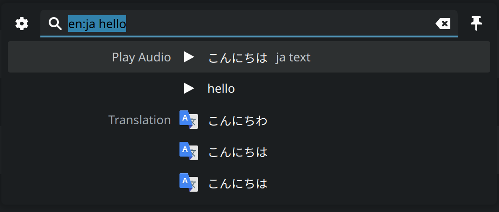

# KRunner Translator (Plasma 6)

KRunner Translator for Plasma 6.

This plugin is derived from [this project](https://github.com/naraesk/krunner-translator) , but it is NOT A DIRECT PORT to plasma 6, so you cannot expect their features will be same. E.g, configuration is not implemented, so you can only use free translate engine.

## Feature

- Translate text

Supported engine: `Google Translate`, `Bing Translate`, `Deepl Web Translate` 

- Play audio for the text

## Usage

This plugin supports two input schemes:

- `target_abbr text`
- `source_abbr:target_abb text`

`target_abbr` / `source_abbr` means the abbreviation of source/target language respectively, and `text`means the text you want to translate.

You can find supported language abbreviation at [here](src/languagerepository.cpp).

Example:

- `ja hello` --> `こんにちは`

- `en:es hello` --> `Hola`

**Notice:**

- You cannot play audio of the *input text* (not *translation*) if you don't specify source language, like picture shown above.
- Deepl translate result maybe frequently unavailable due to its rate limit.

## Installation

1. Install [Translate Shell](https://github.com/soimort/translate-shell)
2. make sure `cmake` / `KDE6` / `Qt6` developing environment is prepared.
3. Run `./install.sh`

## Uninstall

- Run `./uninstall.sh`