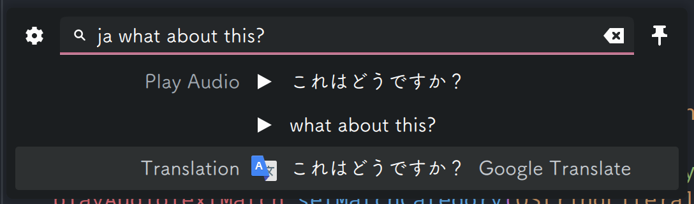

# Translator for KDE KRunner (Plasma 6)

Krunner Translator ported to Plasma 6. 

Original project is here: https://github.com/naraesk/krunner-translator

## Feature

- Translate text

Most of relevant original features are removed. Configuration is not implemented, and Google Translate is the only engine. You could only specify translating destination language. Specifying source language is not supported, the program will always use auto detect. 

Maybe these features would be added back further. 

Usage: `dest_lang_abbr text_to_translate`

For example, 

`ja hello` --> `こんにちは`

 `zh how about this?` --> `这个怎么样？`

- Play audio for the text

As shown above

## Installation

1. Install [Translate Shell](https://github.com/soimort/translate-shell)
2. make sure cmake/kde6 developing environment is prepared
3. Run `./install.sh`

## Uninstall

- Run `./uninstall.sh`