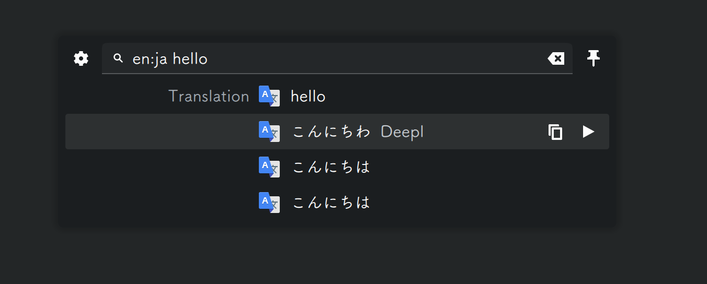
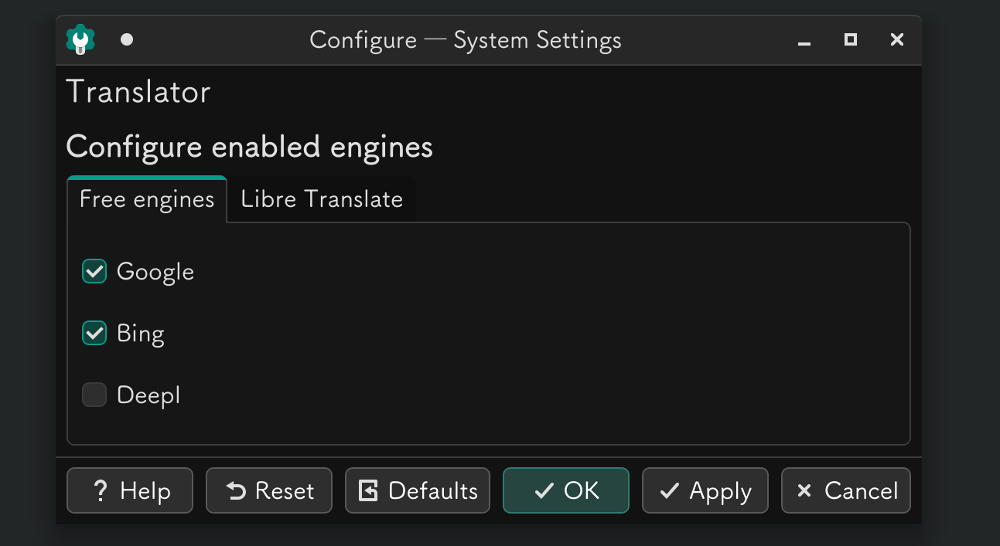

# KRunner Translator (Plasma 6)

KRunner Translator for Plasma 6.

This plugin is derived from [naraesk's krunner-translator for Plasma 5](https://github.com/naraesk/krunner-translator) , but it is NOT A DIRECT PORT to Plasma 6, so you should not expect their features will be same.

## Features

- Translate text

- Play audio for the text

- Configuration (NEW!): enable/disable specific translate engines

Supported engines: 
- `Google Translate`
- `Bing Translate`
- `Deepl Web Translate`
- `Libre Translate` (API address and key are required) 

Screenshots:

## Usage

This plugin supports two input schemes:

1. `target_abbr text`
2. `source_abbr:target_abb text`

`target_abbr` / `source_abbr` means the abbreviation of source/target language respectively, case-insensitive. 
`text` means the text you want to translate.

Different engine has different supported languages:

- `Google Translate` and `Bing Translate`: Both implemented by running [Translate Shell](https://github.com/soimort/translate-shell) in the background, 
[link to supported language and abbreviations](https://github.com/soimort/translate-shell/wiki/Languages). These extra abbreviations
are supported as well: 
  - `zh`: Chinese without variant specification
  - `pt`: Portuguese without variant specification
  - `nb`: Norwegian abbreviation used by Deepl 
- `Deepl Web Translate`: [link](https://developers.deepl.com/docs/getting-started/supported-languages)
- `Libre Translate`: There is no predefined supported language checking, make sure you entered correct abbreviations

Example:

- `ja hello` --> `こんにちは`

- `en:es hello` --> `Hola`

**Notice:**
- You cannot play the audio of the *input text* if you don't specify the source language.
- Since Deepl translate does not ~~support~~ implement auto-detect source language, you must use the second input scheme to get its result if you want.
- Deepl translate result may be frequently unavailable due to its rate limit.

## Installation

1. Install [Translate Shell](https://github.com/soimort/translate-shell), follow its guide if you encounter audio play problem.
2. make sure `cmake` / `KDE6` / `Qt6` developing environment is prepared.
3. Run `./install.sh`

## Uninstall

- Run `./uninstall.sh`